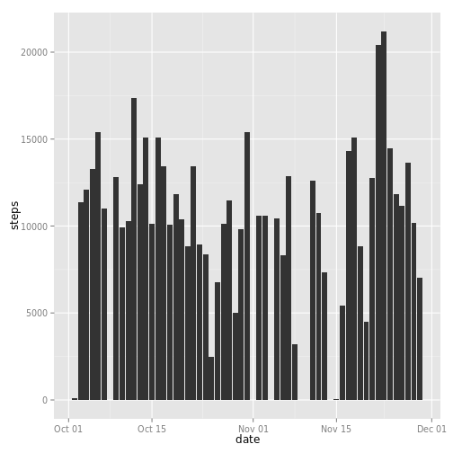
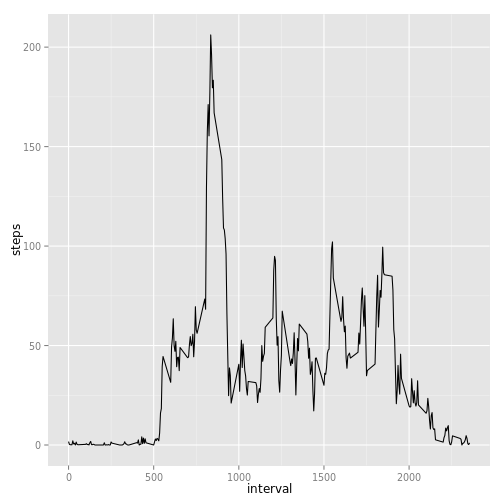
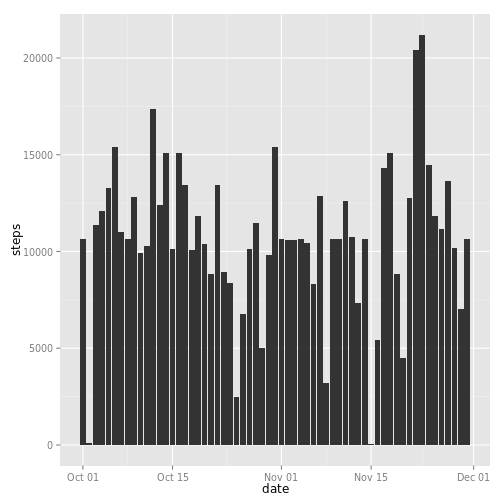
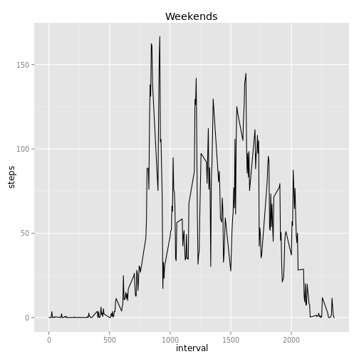
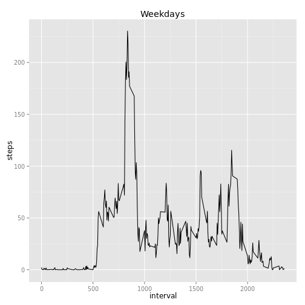

# Reproducible Research: Peer Assessment 1


## Loading and preprocessing the data

_The data is already in the repos (activity.zip)_

* Unzip the file
* Read the csv
* Transform the date column
* Transform the interval into printable time


```r
unzip("activity.zip", c("activity.csv"))
activity <- read.csv("activity.csv", stringsAsFactors=F)
activity$date <- as.Date(activity$date)

# Transform the interval format into a printable time (ie. 155 into "01:55")
interval2time <- function(interval) {
    h = as.integer(interval / 100)
    h = sprintf("%02d", h)
    m = (interval %% 100)
    m = sprintf("%02d", m)
    paste(h, m, sep=":")
}

activity$time <- interval2time(activity$interval)

# let's see what's inside:
summary(activity)
```

```
##      steps            date               interval        time          
##  Min.   :  0.0   Min.   :2012-10-01   Min.   :   0   Length:17568      
##  1st Qu.:  0.0   1st Qu.:2012-10-16   1st Qu.: 589   Class :character  
##  Median :  0.0   Median :2012-10-31   Median :1178   Mode  :character  
##  Mean   : 37.4   Mean   :2012-10-31   Mean   :1178                     
##  3rd Qu.: 12.0   3rd Qu.:2012-11-15   3rd Qu.:1766                     
##  Max.   :806.0   Max.   :2012-11-30   Max.   :2355                     
##  NA's   :2304
```


## What is mean total number of steps taken per day?

Here's some exploration of the data. A Histogram of a total number of steps of each day. At the end, the mean and median of total number of steps per day


```r
library(ggplot2)

print_activity_stats <- function (activity) {
    # calculate the number steps by day
    steps_a_day <- aggregate(activity$steps,
                             by=list(activity$date),
                             FUN=sum)
    
    # change the names
    names(steps_a_day) <- c("date", "steps")
    
    # histogram of steps/day
    chart <- ggplot(steps_a_day) +
        aes(date, steps) +
        geom_histogram(stat="identity")
    
    print(chart)
    
    
    # getting  mean and median values
    steps_mean <- mean(steps_a_day$steps, na.rm=T)
    steps_median <- median(steps_a_day$steps, na.rm=T)
    
    # Mean total number of steps per day
    print(paste("The mean of steps is: ",steps_mean))
    
    # Median total number of steps per day
    print(paste("The median of steps is: ",steps_median))
}

print_activity_stats(activity)
```

```
## Warning: Removed 8 rows containing missing values (position_stack).
```

 

```
## [1] "The mean of steps is:  10766.1886792453"
## [1] "The median of steps is:  10765"
```

## What is the average daily activity pattern?

```r
aggregate_activity <- function(activity) {
    aggregate(list(steps=activity$steps),
              by=list(interval=activity$interval,
              time=activity$time),
              FUN=mean, na.rm=T)
    
}
get_chart_activity_stats_by_interval <- function (activity) {
    steps_interval <- aggregate_activity(activity)
    
    chart <- ggplot(steps_interval) +
        aes(interval, steps) +
        geom_line()
    chart
}

chart <- get_chart_activity_stats_by_interval(activity)
print(chart)
```

 

```r
# Getting the interval with most steps
steps_interval <- aggregate_activity(activity)
max_steps <- max(steps_interval$steps)
max_steps <- steps_interval[max_steps == steps_interval$steps, ]

# Interval with max avg steps
max_steps$time
```

```
## [1] "08:35"
```

```r
# Number of steps in this interval
max_steps$steps
```

```
## [1] 206.2
```


## Imputing missing values

1. Calculate the missing values
2. Fill the missing values (average steps for the same interval)
3. Print the same stats printed previously 


```r
library(data.table)

na_steps <- is.na(activity$steps)

# Amount of NA data
sum(na_steps)
```

```
## [1] 2304
```

```r
# caching the means
steps_idx_by_interval <- steps_interval
rownames(steps_idx_by_interval) <- steps_interval$interval

# setting the mean value
new_activity <- activity

len <- length(new_activity[,1])
for(i in 1:len) {
    curr <- new_activity[i,]
    if (is.na(curr$steps)) {
        steps <- steps_idx_by_interval[as.character(curr$interval),]$steps
        steps <- as.integer(steps)
        new_activity[i,]$steps <- steps
    }
}

print_activity_stats(new_activity)
```

 

```
## [1] "The mean of steps is:  10749.7704918033"
## [1] "The median of steps is:  10641"
```

*As we can see, the mean and median value has been decrease a little*

## Are there differences in activity patterns between weekdays and weekends?


```r
new_activity$is_weekend <- weekdays(new_activity$date, T) %in% c("Sat", "Sun")

weekend_chart <- get_chart_activity_stats_by_interval(new_activity[new_activity$is_weekend, ])
weekend_chart <- weekend_chart +  ggtitle("Weekends")

weekday_chart <- get_chart_activity_stats_by_interval(new_activity[!new_activity$is_weekend, ])
weekday_chart <- weekday_chart +  ggtitle("Weekdays")

weekend_chart
```

 

```r
weekday_chart
```

 


